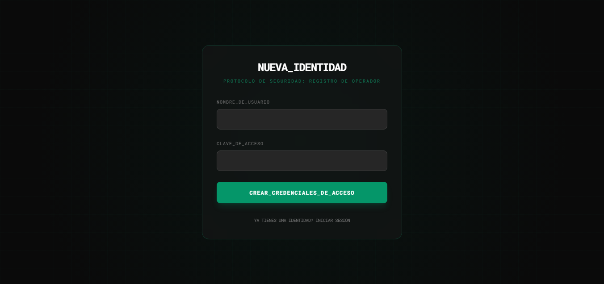
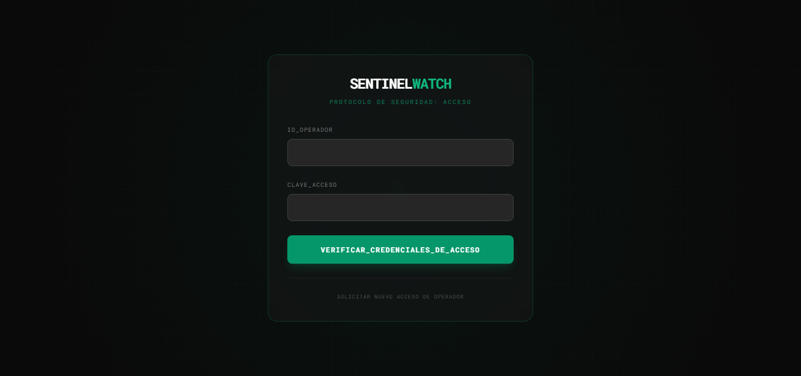
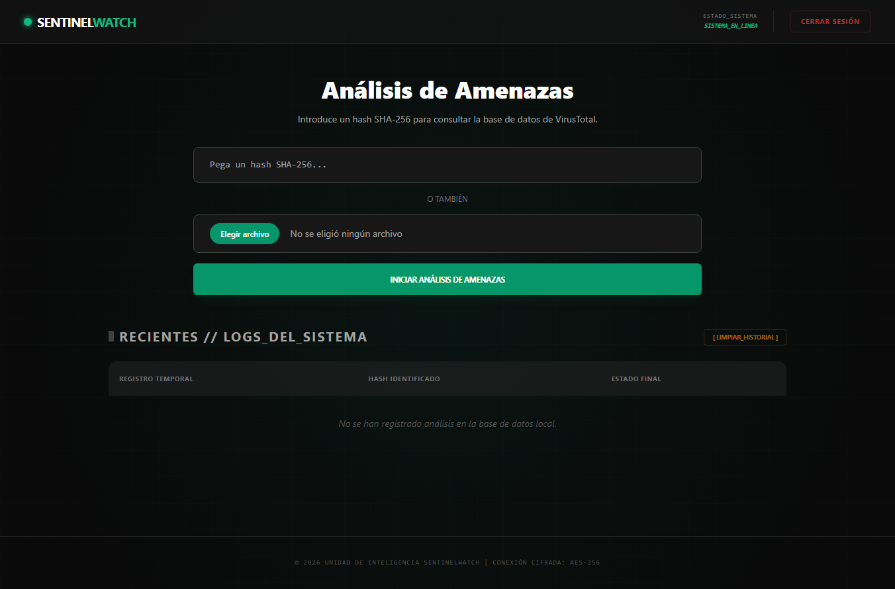
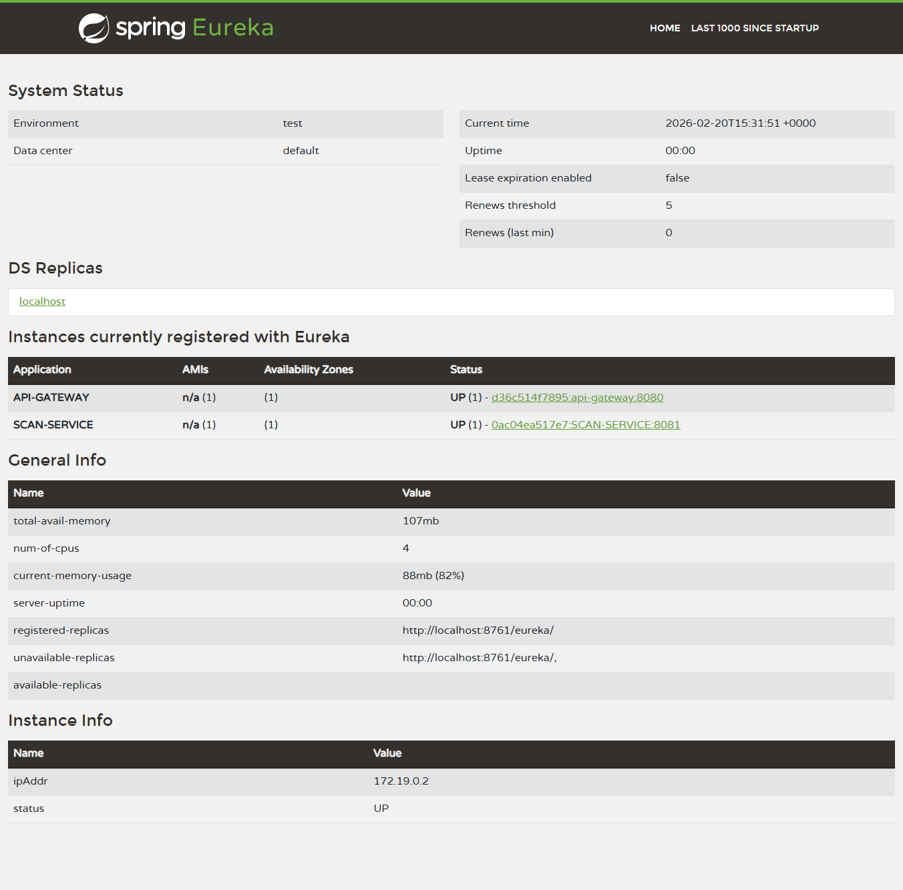
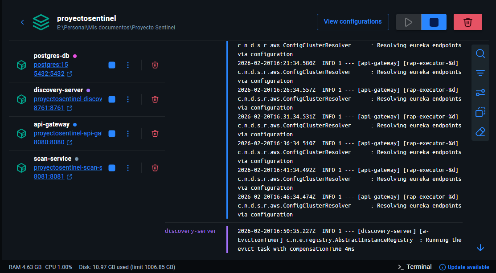

# 🛡️ SentinelWatch - Threat Intelligence Microservice

**SentinelWatch** es una plataforma de ciberseguridad diseñada para el análisis de amenazas mediante la identificación de firmas de archivos (hashes SHA-256). El sistema utiliza una arquitectura de microservicios robusta y se integra con la API de VirusTotal para proveer reportes de seguridad en tiempo real.

---

## Vista Previa del Sistema

### Demostración de Análisis

*(GIF demostrativo analizando un hash malicioso EICAR)*

### Interfaz de Usuario (UI)
Diseño moderno desarrollado con **Tailwind CSS**, enfocado en la experiencia del operador de seguridad.

| Registro de Operador | Protocolo de Acceso | Panel de Control |
| :---: | :---: | :---: |
|  |  |  |
| *Creación de nuevas credenciales* | *Validación de identidad* | *Consola principal de análisis* |

---

## Stack Tecnológico

* **Lenguaje:** Java 21
* **Framework:** Spring Boot 3 (Spring Cloud, Spring Security)
* **Base de Datos:** PostgreSQL
* **Infraestructura:** Docker & Docker Compose
* **Pruebas:** JUnit 5 & Mockito
* **Diseño:** HTML5, JavaScript & Tailwind CSS

---

## Arquitectura de Microservicios

El sistema implementa patrones de diseño distribuidos para garantizar escalabilidad y alta disponibilidad.

* **Discovery Server:** Gestionado con Spring Cloud Netflix Eureka.
* **API Gateway:** Punto único de entrada para el ruteo de peticiones.
* **Scan Service:** Microservicio dedicado al procesamiento de hashes y comunicación con APIs externas.


*Monitoreo de instancias activas en el servidor de descubrimiento*

---

## 🐳 Despliegue con Docker

El proyecto está totalmente contenedorizado, permitiendo un despliegue rápido y consistente mediante Docker Compose.


*Ecosistema de contenedores (Database, Gateway, Discovery y Scan Service) en ejecución*

---

## Calidad de Código y Testing

Se ha implementado una suite de pruebas unitarias para validar la lógica de negocio y la integridad de los controladores, alcanzando un estado de **Build Success** verificado.


*Resultados de ejecución de tests unitarios con Maven*

---

## Configuración del Entorno

Para ejecutar este proyecto localmente, sigue estos pasos:

1. Clonar el repositorio.
2. Crear un archivo `.env` en la raíz basándote en el archivo `.env.example`.
3. Configurar tu `VT_API_KEY` (VirusTotal) en el archivo `.env`.
4. Ejecutar el comando:
   ```bash
   docker-compose up --build